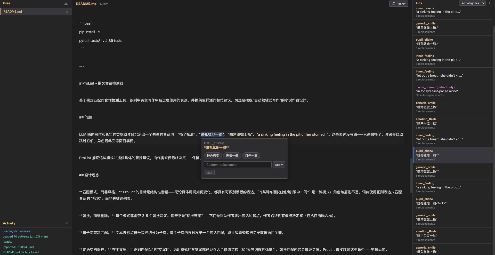

# ProLint - Prose Cliche Linter

A pattern-based linter that detects overused expressions in Chinese and English prose, and suggests fresher alternatives. Designed for fiction writers who want to break free from autopilot phrasing.

**Live demo**: Import a `.txt`, `.md`, or `.docx` file and start reviewing.



## The Problem

LLM-assisted writing and years of genre reading produce a shared pool of cliche patterns: "raised an eyebrow," "a sinking feeling in the pit of her stomach," "嘴角微微上扬," "瞳孔猛地一缩." These phrases aren't wrong — they're just worn out. Readers skim past them. Characters blur together.

ProLint catches these patterns and offers concrete replacements, so the writer can decide — keep, replace, or write something new.

## Design Principles

**Pattern, not style.** ProLint targets structural cliches — expressions that have a recognizable template regardless of the specific words. `"[Something] shifted in [his/her] eyes"` is a pattern; a character frowning is not. The dictionary uses regex to match the *shape* of a cliche, not keyword lists.

**Replace, not delete.** Every pattern comes with 2-5 replacement suggestions. These aren't "correct answers" — they're starting points that break the writer out of the cliche. The writer always has the final say (including a custom input field).

**First match per clause.** Text is split into clauses by punctuation boundaries. Within each clause, only the first cliche match triggers. This prevents cascading replacements that would mangle the sentence.

**Attributive guard.** In Chinese, when a regex match ends with "的" (the attributive particle), it means the pattern has consumed into a modifier structure (e.g., "极其细微的弧度"). Replacing the match would break the sentence. ProLint skips these hits entirely — better to miss a detection than to suggest a broken replacement.

## Surgical DOCX Editing

Most linting tools export to plain text, destroying the document's formatting. ProLint takes a different approach.

A `.docx` file is a ZIP archive containing XML. The actual text lives in `<w:t>` elements inside `word/document.xml`. ProLint reads the XML directly, builds a **node map** that links each character offset to its corresponding XML text node, and performs all replacements at the XML level.

```
Original XML:
<w:r>
  <w:rPr><w:b/></w:rPr>
  <w:t>A sinking feeling in the pit of her stomach</w:t>
</w:r>

After replacement (only text content changes):
<w:r>
  <w:rPr><w:b/></w:rPr>
  <w:t>A cold lurch in the gut</w:t>
</w:r>
```

The `<w:rPr>` (run properties: bold, italic, font, color) is never touched. Neither are styles, headers, footers, images, comments, or any other part of the document. Only the matched text content changes — everything else passes through byte-for-byte.

For hits that span multiple runs (e.g., part of the text is bold), ProLint handles **cross-run replacement**: the replacement text goes into the first affected node, middle nodes are cleared, and the last node keeps its trailing text. The result is a valid `.docx` that opens in Word/WPS/Google Docs with all original formatting intact.

## Architecture

```
nsp-proselint/
  nsp_proselint/           # Python library
    dictionaries/          # Pattern definitions (YAML)
      zh_CN.yaml           # 42 Chinese patterns, 26 categories
      en.yaml              # 28 English patterns, 16 categories
    linter.py              # Core engine: detect + replace
    loader.py              # YAML dictionary loader + regex compiler
    validators/            # Dictionary self-validation
  tests/                   # 89 tests (pytest)
  scripts/
    build_dictionaries.py  # YAML -> JSON for webapp
  webapp/                  # Pure frontend, no server needed
    js/
      linter.js            # JS port of the Python linter
      editor.js            # Text display + inline replacement popup
      files.js             # File import (txt/md/docx via JSZip)
      docx.js              # Surgical XML patching + fallback generation
      app.js               # State management + orchestration
    data/                  # Pre-built dictionary JSON
    lib/                   # Vendored: jszip.min.js, docx.min.js
```

The webapp is a pure static site — no backend, no build step. Deployable to any static hosting (Cloudflare Pages, GitHub Pages, Netlify). All data stays in the browser.

## Dictionary Format

Each pattern entry in the YAML dictionary:

```yaml
- id: "en_held_breath"
  category: "inner_feeling"
  type: "full"
  severity: "replace"
  detect: "let out a breath (?:he|she|they) didn't know (?:he|she|they) (?:had been )?holding"
  replacements:
    - "exhaled slowly"
    - "let the tension go"
    - "relaxed by a fraction"
  test_cases:
    - input: "She let out a breath she didn't know she had been holding."
      valid_outputs: ["She exhaled slowly.", ...]
```

`detect_only` severity flags a pattern without suggesting replacements — useful for AI-generated prose markers like "delve into" or "in today's fast-paced world" where the fix depends entirely on context.

## Usage

### Webapp

Open `webapp/index.html` in a browser (or deploy to any static host). Import files via the button or drag-and-drop. Click gold-highlighted spans to see replacement options.

### Python Library

```python
from nsp_proselint.linter import ProseLinter

linter = ProseLinter(lang="zh_CN")  # or "en"

# Detect
hits = linter.lint("她嘴角微微上扬，眼中闪过一丝不易察觉的光芒。")

# Replace
cleaned = linter.replace("She let out a breath she didn't know she was holding.")

# Replace with diff tracking
result, diffs = linter.replace_with_diff(text)
```

### Tests

```bash
pip install -e .
pytest tests/ -v    # 89 tests
```

---

# ProLint - 散文套话检测器

基于模式匹配的套话检测工具，识别中英文写作中被过度使用的表达，并提供更鲜活的替代建议。为想要摆脱"自动驾驶式写作"的小说作者设计。

## 问题

LLM 辅助写作和长年的类型阅读会沉淀出一个共享的套话池："扬了扬眉"、"瞳孔猛地一缩"、"嘴角微微上扬"、"a sinking feeling in the pit of her stomach"。这些表达没有错——只是磨损了。读者会自动跳过它们，角色因此变得面目模糊。

ProLint 捕捉这些模式并提供具体的替换建议，由作者来做最终决定——保留、替换、或写出全新的表达。

## 设计理念

**匹配模式，而非风格。** ProLint 的目标是结构性套话——无论具体用词如何变化，都具有可识别模板的表达。`"[某种东西]在[他/她]眼中一闪"` 是一种模式；角色皱眉则不是。词典使用正则表达式匹配套话的 *形状*，而非关键词列表。

**替换，而非删除。** 每个模式都附带 2-5 个替换建议。这些不是"标准答案"——它们是帮助作者跳出套话的起点。作者始终拥有最终决定权（包括自由输入框）。

**每子句首次匹配。** 文本按标点符号边界切分为子句。每个子句内只触发第一个套话匹配，防止级联替换把句子改得面目全非。

**定语结构保护。** 在中文里，当正则匹配以"的"结尾时，说明模式的贪婪尾部已经吞入了修饰结构（如"极其细微的弧度"）。替换匹配内容会破坏句法。ProLint 直接跳过这类命中——宁缺毋滥。

## 手术刀式 DOCX 编辑

大多数文本处理工具导出纯文本，丢失文档的全部格式。ProLint 采用不同的方法。

`.docx` 文件本质上是一个 ZIP 压缩包，内含 XML。实际文本存储在 `word/document.xml` 中的 `<w:t>` 元素内。ProLint 直接解析 XML，构建一个**节点映射表**（node map），将每个字符偏移量关联到对应的 XML 文本节点，然后在 XML 层面执行所有替换。

```
原始 XML:
<w:r>
  <w:rPr><w:b/></w:rPr>
  <w:t>瞳孔猛地一缩</w:t>
</w:r>

替换后（只有文本内容变化）:
<w:r>
  <w:rPr><w:b/></w:rPr>
  <w:t>眼神骤然收紧</w:t>
</w:r>
```

`<w:rPr>`（行内格式属性：粗体、斜体、字体、颜色）不会被触碰。样式、页眉、页脚、图片、批注——文档的其他一切部分都不会被修改。只有匹配到的文本内容发生变化，其他一切原封不动。

对于跨越多个 run 的命中（例如部分文本加粗），ProLint 处理**跨 run 替换**：替换文本放入第一个受影响的节点，中间节点清空，最后一个节点保留尾部文本。导出的 `.docx` 在 Word/WPS/Google Docs 中打开时，所有原始格式完好无损。

## 词典规模

| 语言 | 条目数 | 分类数 | 示例分类 |
|------|--------|--------|----------|
| 中文 (zh_CN) | 42 | 26 | 思考动作、瞳孔套话、心脏套话、情绪闪现、比喻套话、空气凝固 |
| 英文 (en) | 28 | 16 | 内心感受、表情套话、身体套话、空洞强调、语气套话、比喻套话 |

## 使用方式

### 在线工具

浏览器打开 `webapp/index.html`（或部署到任意静态托管），导入文件，点击金色高亮的文本段落查看替换选项。

### Python 库

```python
from nsp_proselint.linter import ProseLinter

linter = ProseLinter(lang="zh_CN")
hits = linter.lint("她嘴角微微上扬，眼中闪过一丝不易察觉的光芒。")
cleaned = linter.replace("她嘴角微微上扬。")
```

### 运行测试

```bash
pip install -e .
pytest tests/ -v    # 89 个测试
```
